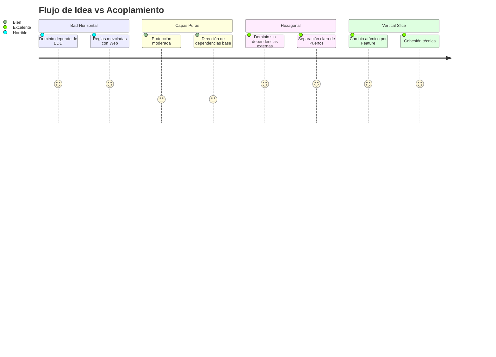

# Arquitecturas Modernas en Java Remasterizado

Este repositorio es un proyecto didáctico diseñado para enseñar diversos estilos de arquitectura de software utilizando Java 21 y Spring Boot 3. 

El modelo de dominio base trata sobre un **Sistema de Gestión de Órdenes e Inventario**, y está implementado repetidas veces bajo 5 enfoques organizacionales diferentes. El propósito de este proyecto es ayudar a los estudiantes a contrastar, observar pros y contras, y comprender cómo diferentes distribuciones de código afectan la navegabilidad, escalabilidad y acoplamiento.

## Módulos del Catálogo

| Módulo | Descripción | Casos Ideales de Uso |
| --- | --- | --- |
| `bad-example-horizontal` | Organización puramente por tipo técnico (capas horizontales). Presenta "Fat Controllers" y lógica filtrada. | **Anti-patrón:** Útil sólo para pruebas de concepto (PoC) que se desechan inmediatamente o scripts rápidos. |
| `layered-architecture` | Arquitectura de Capas robusta (Presentation, Application, Domain, Infrastructure). Protege al dominio pero la infraestructura no está del todo invertida. | Aplicaciones con reglas de negocio moderadas donde el equipo asimila mejor una secuencia Top-Down natural. |
| `hexagonal-architecture` | Patrón de Puertos y Adaptadores. El núcleo del sistema es agnóstico del framework (Spring). Se invierten las dependencias. | Sistemas Core financieros, ERP vitales para el negocio con reglas densas, dominios ricos que cambian con independencia tecnológica. |
| `vertical-slice` | Organización orientada a casos de uso (features) y capacidades. Todo lo necesario para un flujo vive junto, minimizando los saltos de carpetas. | Proyectos muy ágiles orientados a producto donde las features son independientes y se evitan cuellos de botella transversales. |
| `modular-monolith` | Monolito particionado por contextos (Bounded Contexts). Mantiene el despliegue unificado pero refuerza rigurosamente el acoplamiento en tiempo de compilación. | Migraciones hacia microservicios o sistemas grandes corporativos que no pueden/no quieren aún pagar el castigo en red (latency) de la distribución. |

## Pre-requisitos
- Java 21+ instalado.
- Maven 3.8+ instalado o accesible en la máquina.
- Ninguna base de datos externa obligatoria (se utiliza H2 Database en memoria de forma didáctica).

## Cómo ejecutar

El proyecto utiliza un Parent POM de Maven. Puedes compilarlo todo desde la raíz:
```bash
mvn clean install
```
Para inicializar un módulo específico, dirígete a su carpeta o usa:
```bash
mvn spring-boot:run -pl {nombre_modulo}
// Ejemplo
mvn spring-boot:run -pl layered-architecture
```
Luego podrás acceder a la interfaz local Swagger UI via:
`http://localhost:8080/swagger-ui.html`

## Diagrama Comparativo General (Mentalidad Arquitectónica)



Consulta el `README.md` interno de cada módulo para una explicación detallada de las decisiones de diseño aplicadas, así como diagramas propios.

--- 
*Proyecto creado para el curso de Java Backend Avanzado - Cátedra de Arquitecturas Modernas.*
