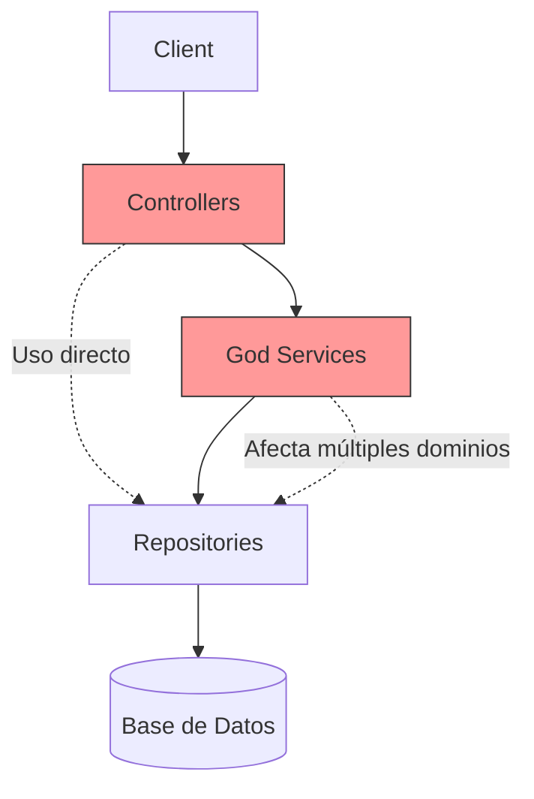

# Bad Example - Horizontal Architecture

Este módulo es una demostración de "cómo no hacer las cosas" cuando un sistema crece.

## Concepto
La organización está dada puramente por el **tipo técnico** de la clase:
- `controller/`
- `service/`
- `repository/`
- `entity/`

## Anti-patrones y Malas Prácticas Implementadas
1. **Fat Controller**: Observa `OrderController`. Contiene lógica de negocio extensa, validaciones manuales, cálculos monetarios y modificaciones de inventario.
2. **God Service**: Observa `InventoryGodService`. Hace demasiadas cosas inconexas (reponer, activar de otra entidad, enviar notificaciones simuladas).
3. **Escapes del Modelo (Entity Exposure)**: Las clases anotadas con `@Entity` viajan directamente como respuesta de los `@RestController`. Esto acopla la forma en que se persiste la información con el contrato público de la API.
4. **Ciclos y recursión en serialización**: El diseño directo de JPA en respuestas JSON sin adaptaciones formales conduce al uso de `@JsonIgnore` para parchear errores de StackOverflow (`OrderItem` -> `Order` -> `OrderItem`).
5. **Altamente Acoplado a Spring y JPA**: Resulta imposible testear las reglas de negocio sin levantar el contexto de Spring o mockear agresivamente infraestructura.

## Diagrama de la (Falta de) Arquitectura

