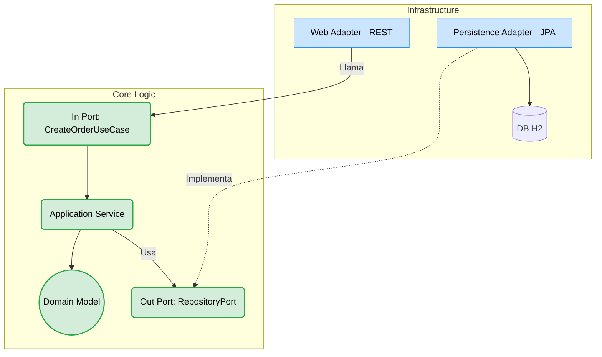

# Hexagonal Architecture (Puertos y Adaptadores)

Este módulo implementa el concepto propuesto por Alistair Cockburn: **La Arquitectura Hexagonal**.
El objetivo es aislar completamente el núcleo de la aplicación (Dominio + Casos de Uso) de las dependencias tecnológicas externas (Web, Base de Datos, Message Brokers).

## Conceptos Clave
1. **Core (Domain + Application)**: Todo el código dentro de `domain` y `application/port` o `application/service` **no tiene dependencias** de Spring Framework (`@Service`, `@Autowired`, `@Entity`) ni de JPA. Es código Java puro.
2. **Ports (Puertos)**: 
   - *Inbound Ports (Puertos de Entrada)*: Interfaces que definen los casos de uso (`CreateOrderUseCase`). Los adaptadores de entrada (Controladores Web) los llaman.
   - *Outbound Ports (Puertos de Salida)*: Interfaces que el Core necesita para funcionar (`OrderRepositoryPort`).
3. **Adapters (Adaptadores)**:
   - *Inbound Adapters*: `OrderController` maneja HTTP y traduce a comandos del caso de uso.
   - *Outbound Adapters*: `OrderPersistenceAdapter` maneja JPA, traduce entidades DB a modelos de dominio puro y los retorna.

## Comparación con Layout en Capas Clásico
- En "Capas", la capa `Domain` con frecuencia termina acoplada a `@Entity` por pragmatismo. Aquí, el Dominio está fuertemente protegido. Todo el modelo de persistencia JPA está confinado en `infrastructure/adapter/out/persistence`.
- Requiere mapeo bidireccional (Entity <-> Model), lo que representa **más código repetitivo** (boilerplate).

## ¿Cuándo usarla?
- Cuando la lógica de negocio es el activo más valioso de la compañía y debe durar más que los frameworks subyacentes.
- Cuando quieres pruebas unitarias ultrarrápidas sobre la lógica sin levantar Spring.

## Diagrama

