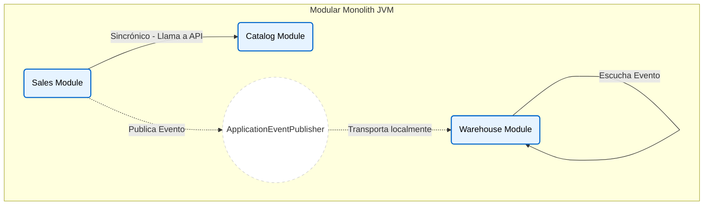

# Modular Monolith (Monolito Modular)

Este módulo muestra uno de los enfoques más defendidos actualmente antes de saltar ciegamente a Microservicios.

## Concepto
Todo se despliega junto como un **solo artefacto** de Spring Boot (`.jar`), pero por dentro, el código está particionado en **Bounded Contexts** muy estrictos.

- `modules/catalog` (Dueño de los productos)
- `modules/sales` (Dueño de las órdenes de compra)
- `modules/warehouse` (Dueño del inventario físico)

## Diferencia con Vertical Slicing
Vertical Slicing agrupa por "casos de uso de usuario" (features). El monolito modular agrupa por "subdominios de negocio". `Sales` tiene muchos casos de uso adentro.

## Estrategias de Integración Mostradas
Si los módulos fueran microservicios, requerirían REST/gRPC/Kafka. Aquí, usamos Spring para mantener todo en la misma JVM pero con barreras de diseño:

1. **API Pública (Sincrónica)**: `sales` necesita saber el precio de un producto. Llama a `CatalogApi` expuesta por `catalog`. ¡Jamás hace un `SELECT` a la tabla `CATALOG_PRODUCT`!
2. **Eventos de Dominio (Asincrónica/Desacoplada)**: Cuando `sales` guarda la orden exitosamente, dispara un `OrderCreatedEvent` de Spring. `warehouse` escucha ese evento y descuenta su stock sin que `sales` tenga que saber qué es el "stock". 

## Diagrama

