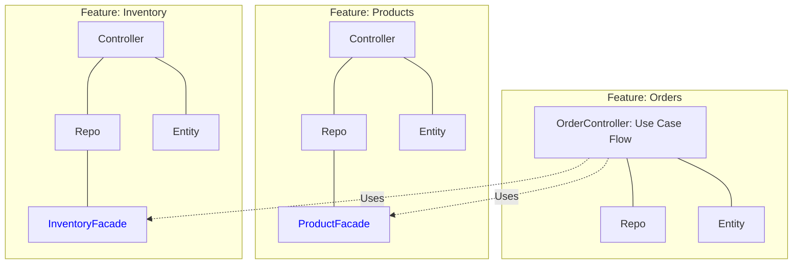

# Vertical Slice Architecture

Este módulo demuestra la arquitectura enfocada en **Features** o **Capabilities** en lugar de capas técnicas.

## Concepto
En lugar de organizar el código por tipo (todos los controllers juntos, todos los services juntos, etc.), agrupamos todo lo que una funcionalidad necesita para operar en una sola carpeta (paquete).

- `features/orders`
- `features/products`
- `features/inventory`
- `features/users`

## Encapsulamiento Inteligente
La gran mayoría de las clases dentro de cada carpeta están marcadas como `package-private` (sin el modificador `public`).
Esto significa que el slice de `orders` NO PUEDE invocar al repositorio de `products` ni usar sus entidades JPA y viceversa.

## Comunicación Inter-Slice
Para que los slices colaboren (ej. Crear una orden requiere descontar inventario), se exponen **Facades públicos** o Interfaces bien definidas (`ProductFacade`, `InventoryFacade`). 
Esto mantiene los bordes del sistema ordenados pero preserva una navegación ultra rápida: si hay un bug en "Crear Orden", sabes exactamente a qué única carpeta mirar.

## Diagrama

