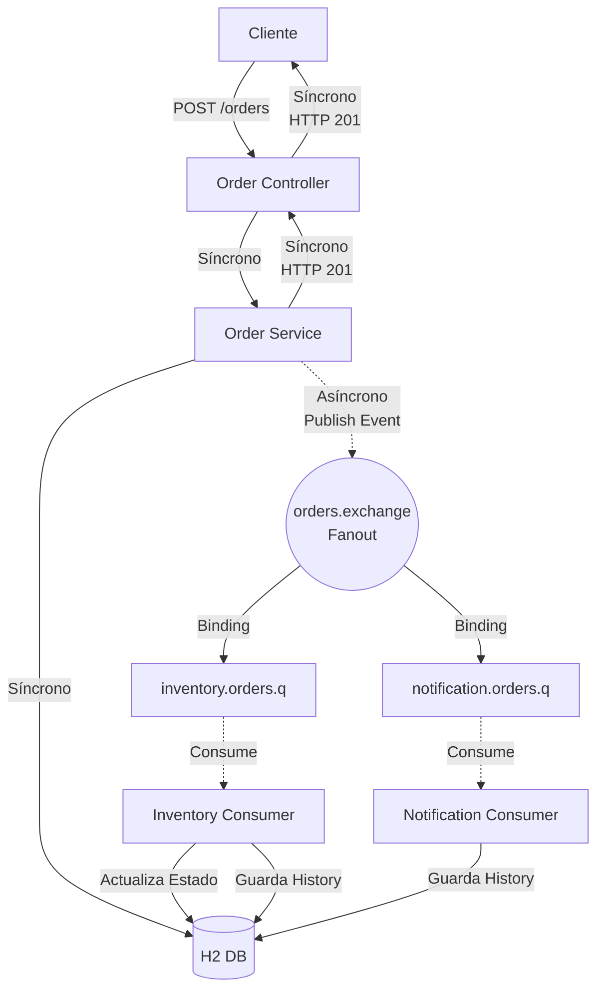
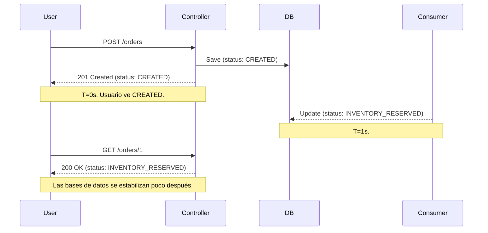

# Event-Driven Design & RabbitMQ en Spring Boot

Este es un proyecto didáctico y ejecutable diseñado en Java 21 con Spring Boot 3.x para enseñar y demostrar en clase los conceptos fundamentales del **Event-Driven Design (EDD)** y el funcionamiento de los **sistemas de mensajería asíncrona**.

## 1. Objetivo del proyecto

El objetivo es proporcionar un entorno de demostración, simple y claro, donde se pueda observar y explicar un sistema de propagación de eventos, desacoplamiento y persistencia eventual sin la sobrecarga cognitiva de un sistema de calidad _enterprise_ completo.

## 2. Conceptos que enseña

Este proyecto sirve para ilustrar:
- **Eventos:** Qué son y cómo viajan como DTOs (Data Transfer Objects).
- **Comunicación síncrona vs. asíncrona.**
- **Productores y Consumidores:** Quién gatilla la acción y quién reacciona.
- **Broker de Mensajería:** Rol de RabbitMQ recibiendo y distribuyendo los paquetes.
- **Publish/Subscribe (Pub/Sub):** Múltiples escuchas interesados en el mismo suceso.
- **Desacoplamiento:** El hilo de la petición HTTP no espera a los procesos del negocio pesado.
- **Consistencia eventual:** Estados que no se reflejan instantáneamente pero terminan siendo consistentes.
- **Reintentos (Retries):** Tolerancia a fallos momentáneos y requeing.
- **Idempotencia:** Evitar procesamiento duplicado por _at-least-once deliveries_.

---

## 3. Arquitectura general



---

## 4. Flujo del evento paso a paso

1. Un cliente envía una solicitud `POST /orders` para comprar productos.
2. `OrderService` guarda la orden en estado **`CREATED`**.
3. Inmediatamente, propaga el mensaje *`OrderCreatedEvent`* (que incluye el ID de la orden y un `eventId` único) usando el *Fanout Exchange* de RabbitMQ.
4. El hilo de la petición origina un `HTTP 201 Created` casi instantáneamente.
5. RabbitMQ entrega el mensaje en forma paralela a sus 2 colas.
6. A nivel de microsegundos después, los consumidores (`Inventory` y `Notification`) lo recojen.
7. Simulan un procesamiento pesado (Sleeps condicionales).
8. Actualizan y persisten su propia huella y completan su labor.

---

## 5. Diferencia entre HTTP síncrono y procesamiento asíncrono

En este código podrás notar en los logs que la solicitud inicial termina *antes* de que los consumidores hayan terminado de despachar. El diseño tradicional web (síncrono) bloquearía al cliente aguardando que terminen Inventario y Correo, elevando la latencia a 3-4 segundos innecesariamente e introduciendo múltiples posibles puntos de fallo para la respuesta central. En EDD, la orquestación recae en RabbitMQ.

---

## 6. Cómo correr RabbitMQ con Docker Compose

La forma más sencilla de levantar un RabbitMQ limpio en desarrollo es con Docker. El archivo `docker-compose.yml` preconfigura los puertos base y la UI (Management System).

Ejecuta:
```bash
docker-compose up -d
```
Una vez arriba, puedes acceder al Dashboard visual:
**URL:** [http://localhost:15672](http://localhost:15672)  
**Usuario:** `user`  
**Password:** `password`

---

## 7. Cómo ejecutar el proyecto

Este proyecto fue construido con Maven. En el directorio raíz de la aplicación corre:
```bash
mvn clean install -DskipTests
mvn spring-boot:run
```

---

## 8. Endpoints disponibles

- `POST /orders` : Crea una orden.
- `GET /orders` : Devuelve la lista de todas las órdenes.
- `GET /orders/{id}` : Devuelve el estado actual de una orden concreta.
- `POST /simulate/failure/inventory?fail=boolean` : Permite encender o apagar la simulación de error en el consumidor del inventario.

### H2 Database Console
Una vez levantado Spring Boot:
- URL de la consola de BD en memoria: `http://localhost:8080/h2-console`
- JDBC URL: `jdbc:h2:mem:edd_db`
- Username: `sa`
- Password: `password`

---

## 9. Ejemplo de request y response

**Request (POST /orders):**
```json
{
  "customerId": "CUST-987",
  "items": [
    {
      "productId": "PROD-A001",
      "quantity": 2
    }
  ]
}
```

**Response (Inmediato - Status 201):**
```json
{
  "id": 1,
  "customerId": "CUST-987",
  "status": "CREATED",
  "createdAt": "2023-11-04T12:00:00",
  "items": [
    { ... }
  ]
}
```

---

## 10. Cómo explicar este proyecto en clase

Sigue este guion lógico en tu demostración de clase:
1. Muestra el `docker-compose.yml` levantando el RabbitMQ y explica brevemente el panel de administración.
2. Abre la clase `RabbitMQConfig.java` y explica qué es un _Exchange_ y hacer _Bind_ a las _Queues_.
3. Ejecuta la aplicación y tira una petición normal en Postman/cURL. 
4. Lee y sigue el rastro de LOGS síncronos y asíncronos. Verás que llega el mensaje _"HTTP finalizado"_ antes de los logs _"Procesando inventario"_.
5. Revisa la base de datos para mostrar que la orden, que nació en `CREATED`, ahora dice `INVENTORY_RESERVED`. 
6. Entra a `InventoryConsumer.java` y muestra el `simulateFailure` y cómo funciona la Idempotencia.

---

## 11. Dónde se ve Pub/Sub
- En `RabbitMQConfig.java`: Utilizamos un **`FanoutExchange`**. El fanout copia el mismo mensaje a todas las colas vinculadas ignorando claves de enrutamiento, haciendo posible que 1 solo `publish()` termine siendo atrapado por `n` clases Java de módulos/consumidores distintos.
- En la terminal de RabbitMQ: Al consultar el exchange de `orders.exchange` puedes ver sus 2 bindings activos.

---

## 12. Dónde se ve Consistencia Eventual


Al momento exacto de crearla, la orden es `CREATED`. Un instante después (por el hilo asíncrono y el `Thread.sleep(1000)` en el Inventory), cambia de estado al estar reservada permanentemente. Las tablas convergen a un estado real con cierto retraso intencional.

---

## 13. Dónde se ve Idempotencia

En ambos `*Consumer.java`.
RabbitMQ garantiza envío _al menos una vez_ (At-Least-Once Delivery). En sistemas estables, es común recibir duplicados. 
Si el consumidor recibe el evento dos veces (por ejemplo un microcorte lo forzó a retransmitir), el código hace:
```java
if(processedEventRepository.existsByEventIdAndConsumerName(eventId, name)){
    // El evento ya se procesó con éxito. Se descarta silenciosamente.
    return;
}
```
Esto anula la duplicación de reservaciones y el cobro de cosas múltiples originadas en un mismo suceso.

---

## 14. Dónde se ve Retry

Si levantas el flag `POST /simulate/failure/inventory?fail=true`, lanzarás un `RuntimeException` en el consumidor. Al estar configurado Spring Boot con:
```yaml
spring.rabbitmq.listener.simple.retry.enabled: true
spring.rabbitmq.listener.simple.retry.max-attempts: 3
```
Verás en consola cómo un mensaje intenta ser procesado varias veces con _backoff_ (2s de espera entre ellos) hasta tirarse al basurero si no se deshabilita la falla en el intermedio.

---

## 15. Limitaciones del proyecto

Al tratarse de una implementación simplificada para clase, este escenario carece de prácticas comunes en producción, como:
- Bases de datos segregadas. (Aquí usamos un H2 unificado porque era necesario simular, pero idealmente cada dominio tendría su BD en servicios diferentes).
- Gestión estricta de Dead Letter Queues (DLQ) programáticas (lo básico va a discard si expiran los retries).
- Fallbacks. En este proyecto si falla el inventario irremediablemente, la orden se queda permanentemente en `CREATED` (requeriría el *Saga Pattern* o de compensación para arreglarlo).

---

## 16. Cómo evolucionar este proyecto

Si se deseara llevar esto a un **Enterprise-grade System**:
- **Desacople real (Microservicios):** En lugar de tener los consumers en el mismo repo de código, dividirlos en 3 proyectos distintos (Order Service, Inventory Service, Notification Service).
- **Dead Letter Queues:** Crear e inyectar colas de retención de mensajes envenenados `*.dlq` al RabbitMQConfig.
- **Outbox Pattern:** En lugar de hacer _DB_save_ + _publish_ (lo cual no es atómico y si RabbitMQ cae se pierde el evento emitido tras un _save_), utilizar una tabla tabla Outbox que despache con un *Polling Publisher*.
- **Sagas Coreografiadas o de Orquestación:** Para los casos donde el inventario falla. Emitir un `InventoryFailedEvent` a otra cola para que Orders anule el pedido base con un estado de `CANCELED_NO_INVENTORY`.
- **Evolución a Apache Kafka:** Para un bus transaccional y basado en logs donde el historial de eventos se mantenga vivo perpetuamente, en oposición a un broker por colas finitas.
